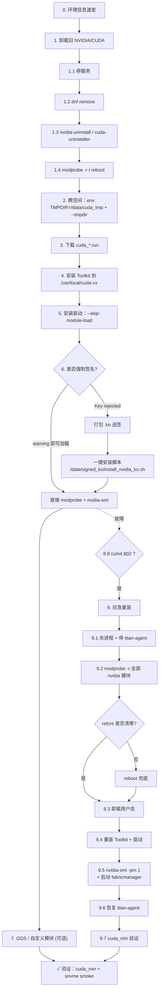

# TencentOS 上手动安装 NVIDIA 驱动 + CUDA Toolkit 教程

> 适用场景：TencentOS Server 3.2（`platform:el8.2`），内核 `5.4.241-1-tlinux4-xxxx`，内核启用了强制模块签名（`module.sig_enforce=Y`），需要通过公司签名系统对内核模块送签后才能加载。
>
> 根目录 `/` 空间紧张（例如只剩 3G），但 `/usr/local`、`/data` 有较大空间。

---

## 0. 环境信息速查

先记录以下几项信息，后续步骤都会用到：

```bash
# 发行版
cat /etc/os-release

# 内核版本（整条命令的输出非常关键）
uname -r

# 磁盘分布
df -h

# 当前 NVIDIA 相关包
rpm -qa | grep -Ei 'nvidia|cuda|cudnn|nccl|tensorrt|libcuda|nvml|gds' | sort

# 当前已加载的 NVIDIA 模块
lsmod | grep nvidia

# 当前驱动版本（如果没有此文件，说明驱动没加载）
cat /proc/driver/nvidia/version 2>/dev/null || echo "no nvidia driver loaded"
```

假设后续示例中：

- `uname -r` = `5.4.241-1-tlinux4-0017.7`
- `/` 空间紧张，`/usr/local` 和 `/data` 空间充裕

---

## 1. 卸载运维自带 / 旧的 NVIDIA & CUDA

### 1.1 查看当前相关包

```bash
rpm -qa | grep -Ei 'nvidia|cuda|cudnn|nccl|tensorrt|libcuda|nvml|gds' | sort
```

### 1.2 停止依赖 NVIDIA 的后台服务

先停掉可能打开 `/dev/nvidia*` 的服务，否则后面无法卸载内核模块：

```bash
systemctl stop docker containerd kubelet nvidia-persistenced dcgm dcgm-exporter 2>/dev/null || true
systemctl stop nvidia-fabricmanager 2>/dev/null || true
systemctl disable nvidia-fabricmanager 2>/dev/null || true
```

### 1.3 卸载 NVIDIA 容器/CUDA/FabricManager 等 RPM

```bash
dnf remove -y \
  'libnvidia-container-tools' \
  'libnvidia-container1' \
  'nvidia-container-runtime' \
  'nvidia-container-toolkit' \
  'nvidia-docker2' \
  'nvidia-fabricmanager' \
  'cuda-*' \
  'cudnn*' \
  'nccl*' \
  'tensorrt*' 2>/dev/null || true

dnf autoremove -y
dnf clean all
```

### 1.4 如果存在 `.run` 安装的 NVIDIA 驱动，先跑官方卸载器

```bash
which nvidia-uninstall && nvidia-uninstall --silent || echo "no nvidia-uninstall"
which cuda-uninstaller && cuda-uninstaller --silent || echo "no cuda-uninstaller"
```

### 1.5 卸载已加载的内核模块

查看是否有进程在占用：

```bash
fuser -v /dev/nvidia* 2>/dev/null
lsof /dev/nvidia* 2>/dev/null
```

如果看到占用进程（例如运维采集 agent：`/usr/local/agenttools/agent/plugins/titan_tools/deviceQuery`），需要先停掉对应服务再继续：

```bash
# 根据实际情况 kill 或 stop 对应 service
systemctl list-units --type=service | grep -Ei 'agent|titan|gpu|nvidia'
kill <PID>
```

然后按依赖倒序卸载模块：

```bash
modprobe -r nvidia_fs 2>/dev/null || true
modprobe -r nvidia_peermem 2>/dev/null || true
modprobe -r nvidia_uvm 2>/dev/null || true
modprobe -r nvidia_modeset 2>/dev/null || true
modprobe -r nvidia_drm 2>/dev/null || true
modprobe -r gdrdrv 2>/dev/null || true
modprobe -r nvidia 2>/dev/null || true

lsmod | grep nvidia   # 应全部清空
```

如果仍有模块在用，**最稳妥是重启**：

```bash
reboot
```

### 1.6 验证已清理干净

```bash
rpm -qa | grep -Ei 'nvidia|cuda|cudnn|nccl|tensorrt|libcuda|nvml|gds'
lsmod | grep nvidia
which nvidia-smi nvcc
```

均无输出即清理完成。

---

## 2. 腾空间准备（`/` 紧张时的关键步骤）

CUDA `.run` 安装时会：

- 默认解压到 `/tmp`（大约需要 5–8 GB），通过 `TMPDIR` + `--tmpdir` 改到大盘
- Toolkit 默认装到 `/usr/local/cuda-xx.y`（大约 5–10 GB）
- 驱动用户态装到 `/usr/bin`、`/usr/lib64` 等（少量，< 1GB）
- 内核模块编译到 `/lib/modules/$(uname -r)/...`（少量）

当 `/` 紧张时：

### 2.1 建临时目录到大盘

```bash
# 给 .run 解压用
mkdir -p /data/cuda_tmp
chmod 1777 /data/cuda_tmp
```

### 2.2 使用 `TMPDIR=/data/cuda_tmp` 跑安装器

后续所有 `.run` 命令都走：

```bash
sudo env TMPDIR=/data/cuda_tmp sh xxx.run --tmpdir=/data/cuda_tmp ...
```

必须同时设置两个：

- **`env TMPDIR=/data/cuda_tmp`**：让 `.run` 解压阶段使用的标准临时目录走大盘
- **`--tmpdir=/data/cuda_tmp`**：让 NVIDIA 安装器自身的工作目录也走大盘

`sudo` 默认会丢掉环境变量，所以要用 `sudo env TMPDIR=...`，不要写成 `sudo TMPDIR=... sh xxx.run`。

> 不建议用 `mount --bind /data/cuda_tmp /tmp`。直接使用 `TMPDIR=/data/cuda_tmp` + `--tmpdir` 即可，避免影响系统其它进程的 `/tmp` 使用。

### 2.3 保留 `/` 至少 1–2 GB 给 RPM/driver userspace

CUDA Toolkit 主体可放 `/usr/local`，但 **驱动用户态** (`/usr/bin/nvidia-smi`、`/usr/lib64/libnvidia-*.so`) 必须装到系统目录，这部分省不了，因此根目录不能彻底满。

---

## 3. 下载安装包

从 NVIDIA 官方下载 CUDA `.run`（系统选 **Linux → x86_64 → RHEL → 8 → runfile(local)**）：

```text
https://developer.nvidia.com/cuda-downloads
```

例如：

```bash
cd /data/packages
wget https://developer.download.nvidia.com/compute/cuda/13.0.0/local_installers/cuda_13.0.0_580.65.06_linux.run
```

> TencentOS 3.2 按 **RHEL 8 / EL8** 兼容。**不要选 Fedora / Ubuntu / RHEL9 / CentOS7**。
> 版本建议：如果你原有生态基于 CUDA 12.x，就继续装 12.8.x；如无历史包袱可上 CUDA 13.x。

---

## 4. 安装 CUDA Toolkit（不装驱动内核模块）

分两步：先 Toolkit，再驱动。**不要一把梭装驱动**，避免立刻撞签名问题。

### 4.1 解压（可选，便于单独拿出驱动 runfile）

```bash
sudo env TMPDIR=/data/cuda_tmp \
  sh cuda_13.0.0_580.65.06_linux.run \
    --extract=/data/cuda_tmp/extracted \
    --tmpdir=/data/cuda_tmp
```

解压后 `/data/cuda_tmp/extracted/` 下会有：

```text
NVIDIA-Linux-x86_64-580.65.06.run   # 驱动单独的 runfile
cuda_*.run                          # Toolkit / 子组件
```

> 若 `Extraction failed`，多半是没走大盘。必须 **同时** 带 `env TMPDIR=/data/cuda_tmp` 和 `--tmpdir=/data/cuda_tmp`，缺一不可。

### 4.2 只装 Toolkit

```bash
sudo env TMPDIR=/data/cuda_tmp \
  sh cuda_13.0.0_580.65.06_linux.run \
    --silent \
    --toolkit \
    --toolkitpath=/usr/local/cuda-13.0 \
    --tmpdir=/data/cuda_tmp \
    --override
```

参数说明：

| 参数 | 说明 |
|------|------|
| `--silent` | 无人值守 |
| `--toolkit` | 只装 Toolkit，不装驱动 |
| `--toolkitpath=` | 装到 `/usr/local/cuda-13.0` |
| `--override` | 忽略部分兼容性检查（gcc 版本、系统支持度等） |
| `--tmpdir=` | 指定临时目录 |

完成后设置环境变量：

```bash
cat <<'EOF' >> ~/.bashrc

# CUDA
export CUDA_HOME=/usr/local/cuda-13.0
export PATH=$CUDA_HOME/bin:$PATH
export LD_LIBRARY_PATH=$CUDA_HOME/lib64:$LD_LIBRARY_PATH
EOF
source ~/.bashrc

nvcc --version
```

---

## 5. 安装 NVIDIA 驱动（编译但不加载）

### 5.1 准备内核源码

查看内核源码是否就绪：

```bash
ls /usr/src/kernels/$(uname -r)/Makefile
ls /usr/src/kernels/$(uname -r)/Module.symvers
ls /usr/src/kernels/$(uname -r)/scripts/sign-file
```

三个都在就不用装 `kernel-devel`。TencentOS 通常不把它放在 yum 源，但机器里已经释放好了。

准备编译工具链：

```bash
dnf install -y gcc make pkgconf-pkg-config elfutils-libelf-devel
```

### 5.2 用 `--skip-module-load` 编译并安装（但不 `modprobe`）

```bash
sudo env TMPDIR=/data/cuda_tmp \
  sh /data/cuda_tmp/extracted/NVIDIA-Linux-x86_64-580.65.06.run \
    --silent \
    --skip-module-load \
    --no-drm \
    --no-x-check \
    --no-nouveau-check \
    --no-systemd \
    --kernel-source-path=/usr/src/kernels/$(uname -r) \
    --tmpdir=/data/cuda_tmp
```

关键参数：

| 参数 | 说明 |
|------|------|
| `--skip-module-load` | **安装 .ko 但不加载**，避免立刻触发签名校验失败 |
| `--no-drm` | 不装 `nvidia-drm`（无桌面环境不需要） |
| `--no-x-check` | 跳过 X server 检查 |
| `--no-nouveau-check` | 跳过 nouveau 检查 |
| `--no-systemd` | 不装 systemd 单元（按需） |
| `--kernel-source-path=` | 指定内核源码路径 |

### 5.3 找出已编译出的 `.ko`

```bash
find /lib/modules/$(uname -r) -name 'nvidia*.ko*'
```

预期看到：

```text
/lib/modules/.../kernel/drivers/video/nvidia.ko
/lib/modules/.../kernel/drivers/video/nvidia-modeset.ko
/lib/modules/.../kernel/drivers/video/nvidia-uvm.ko
/lib/modules/.../kernel/drivers/video/nvidia-peermem.ko
/lib/modules/.../extra/nvidia-fs.ko           # 如果装了 GDS 子组件
```

如果是 `.ko.xz`，送签前先解压：

```bash
sudo find /lib/modules/$(uname -r) -name 'nvidia*.ko.xz' -exec unxz {} \;
```

---

## 6. 内核模块签名（TencentOS 强制签名环境）

### 6.1 判断是否真的需要签名

```bash
cat /sys/module/module/parameters/sig_enforce    # Y = 强制
mokutil --sb-state 2>/dev/null

sudo depmod -a
sudo modprobe nvidia
dmesg | tail -30
```

- `dmesg` 如果只是 `module verification failed: signature and/or required key missing - tainting kernel`，**这是 warning**，模块仍加载。可直接 `nvidia-smi`。
- 如果是 `Key was rejected by service` / `Loading of unsigned module is rejected`，才必须走公司签名系统。

### 6.2 打包上传到公司签名系统

```bash
mkdir -p /data/ko-to-sign
cp /lib/modules/$(uname -r)/kernel/drivers/video/nvidia*.ko /data/ko-to-sign/
cp /lib/modules/$(uname -r)/extra/nvidia-fs.ko /data/ko-to-sign/ 2>/dev/null || true

cd /data
tar czvf ko-to-sign-$(uname -r).tar.gz ko-to-sign/
ls -lh /data/ko-to-sign-*.tar.gz
```

需要签的文件清单（按环境按需增减）：

| 模块 | 是否必需 | 用途 |
|------|---------|------|
| `nvidia.ko` | ✅ | 核心驱动 |
| `nvidia-modeset.ko` | ✅ | 显示/模式设置 |
| `nvidia-uvm.ko` | ✅ | UVM，CUDA 必需 |
| `nvidia-peermem.ko` | 视情况 | P2P / RDMA |
| `nvidia-fs.ko` | GDS 需要 | GPUDirect Storage |
| `gdrdrv.ko` | 可选 | GDRCopy |
| `snvme.ko` | 可选 | 项目自带的内核模块 |

上传至公司签名系统，拿到签好名的 `.ko`，放回目录，例如 `/data/signed_ko/signed_ko/`。

### 6.3 一键安装签名后的 `.ko`

项目内提供了安装脚本：`/data/signed_ko/install_nvidia_ko.sh`（已创建）。逻辑：

1. 卸载已加载的旧模块
2. 清理 `/lib/modules/$(uname -r)/kernel/drivers/video/` 和 `extra/` 下的同名旧文件（含 `.ko.xz/.ko.zst/.ko.gz`）
3. 将签名后的 `.ko` 安装到 **`/usr/lib/modules/$(uname -r)/extra/`**
4. 打印每个 `.ko` 的 `signer / sig_key / sig_hash / vermagic`
5. `depmod -a`
6. 按 `nvidia → nvidia_modeset → nvidia_uvm → nvidia_peermem → nvidia_fs` 顺序 `modprobe`
7. `lsmod | grep nvidia` + `nvidia-smi` 自检

执行：

```bash
sudo bash /data/signed_ko/install_nvidia_ko.sh
```

### 6.4 验证

```bash
lsmod | grep nvidia
nvidia-smi
modinfo nvidia | grep -iE 'signer|sig_key|sig_hash'
```

看到 `signer:` 是公司签名 CA 且 `nvidia-smi` 能列出 GPU，即成功。

---

## 7. 安装 GDS (`nvidia-fs`) 与自定义内核模块（可选）

### 7.1 GDS 用户态

CUDA Toolkit 安装完默认带了 `libcufile.so`、`gdscheck` 等用户态。验证：

```bash
ls /usr/local/cuda-13.0/gds/
/usr/local/cuda-13.0/gds/tools/gdscheck -p
```

### 7.2 `nvidia-fs.ko` 内核模块

若你在第 5 节 `.run` 安装时选择了 GDS，`nvidia-fs.ko` 已被编译到 `/lib/modules/$(uname -r)/extra/`。按第 6 节一起送签即可。

如果源码在 `/usr/src/nvidia-fs-X.Y.Z/`，也可以单独编译：

```bash
cd /usr/src/nvidia-fs-*/
make
# 拿到 nvidia-fs.ko 送签后放回 /usr/lib/modules/$(uname -r)/extra/
```

### 7.3 项目自带内核模块（如 `snvme.ko`）

```bash
cd /data/home/ryeqiu/Geminifs/backends/local/kernel_modules/snvme-5.4
make
# 将编译产物 snvme.ko 送签，签好后：
sudo cp snvme.ko /usr/lib/modules/$(uname -r)/extra/
sudo depmod -a
sudo modprobe snvme
lsmod | grep snvme
```

---

## 8. 常见问题

### 8.1 `Curl error (23): Failed writing received data to disk`

**磁盘写入失败**。通常是 `/` 或 `/var` 满。先：

```bash
df -h / /var
df -i / /var
du -xh --max-depth=1 / 2>/dev/null | sort -hr | head -30
dnf clean all
journalctl --vacuum-time=3d
```

### 8.2 `.run` 报 `Extraction failed`

几乎都是 `/tmp` 空间不够。用：

```bash
sudo env TMPDIR=/data/cuda_tmp TMP=/data/cuda_tmp TEMP=/data/cuda_tmp \
  sh xxx.run --extract=/data/cuda_tmp/extracted --tmpdir=/data/cuda_tmp
```

必须 **同时** 带 `env TMPDIR=...` 和 `--tmpdir=...`，只带其一有可能仍落到 `/tmp`。不要用 `mount --bind /tmp`，直接用上面的环境变量方式即可。

### 8.3 `modprobe: Key was rejected by service`

说明 `sig_enforce=Y` 且 `.ko` 没有被内核信任的 CA 签过。
→ 走第 6 节公司签名流程。
→ 确认覆盖时路径正确，且 `.ko` 没有被 `.xz/.zst` 压缩变体干扰。

### 8.4 `sh: dkms: command not found` 且 `nvidia_fs` 加载失败

两个独立问题：

- `dkms` 没装：只是 `.run` 想走 DKMS 路径，可忽略或 `dnf install dkms`。
- `nvidia_fs` 加载失败根因仍是签名。走第 6 节签名流程。

### 8.5 占用 `/dev/nvidia*` 的进程无法 kill

运维 agent（如 `/usr/local/agenttools/agent/plugins/titan_tools/deviceQuery`）常被守护进程拉起。定位到父服务并 stop：

```bash
systemctl list-units --type=service | grep -Ei 'agent|titan'
systemctl stop <服务名>
systemctl disable <服务名>
```

或直接重启机器最省事。

### 8.6 `nvidia-smi` 命令没了但 `lsmod` 还有 `nvidia`

用户态包被卸了，但内核模块还加载着。
→ 这正是你第 1.5 节要处理的场景。先停占用进程再 `modprobe -r`，或重启。

### 8.7 驱动版本和内核里已加载的 `.ko` 不一致

`.run` 里的用户态版本必须与 `/proc/driver/nvidia/version` 完全一致，否则 `nvidia-smi` 连不上驱动。
→ 查 `cat /proc/driver/nvidia/version`，下载对应版本 `.run`，加 `--no-kernel-module` 只装用户态。

### 8.8 `cudaGetDeviceCount` 返回 `system not yet initialized`（802）

驱动状态机被拖坏的典型故障，`nvidia-smi` 看上去全好但任何 CUDA 程序在 `cuInit()` 就 802。常见根因（按命中顺序排查）：

1. **NVSwitch 8 卡机器（HGX H20 / H100）但 `nvidia-fabricmanager` 没启动**
   ```bash
   ls /dev/nvidia-nvswitch* >/dev/null 2>&1 && \
       systemctl is-active nvidia-fabricmanager
   # active 才正常；inactive / not found 就是这个问题
   ```
2. **persistence mode 关闭，导致 fabric 注册过不去**
   ```bash
   nvidia-smi --query-gpu=persistence_mode --format=csv,noheader
   # 应全是 Enabled；Disabled 就是这个问题
   sudo nvidia-smi -pm 1
   ```
3. **Fabric 注册没完成**：判定标准是 `nvidia-smi -q` 输出的每张 GPU 的 `Fabric` 块，里面应有：
   ```text
       Fabric
           State                             : Completed
           Status                            : Success
   ```
   如果 `State` 不是 `Completed` 或 `Status` 不是 `Success`，说明 fabricmanager 配完 NVSwitch 路由后 GPU 还没通过 NVLink Inband 注册成功。
   ```bash
   nvidia-smi -q | awk '/^    Fabric$/,/^$/' | grep -E 'State|Status'
   tail -20 /var/log/fabricmanager.log
   ```
   > **注意**：`GPU Fabric GUID : N/A` 在 H20 / 580.65.06 这类组合上**是正常的**，不能用作故障判据 —— 某些 firmware/driver 组合下这个字段就是 `N/A`，但 fabric 注册依然 `Completed`。务必只看 `State` / `Status` 这两行。
4. **`/sys/module/nvidia/refcnt` 异常高**（正常应 < 10，常见 30+ 是 leak）
   ```bash
   cat /sys/module/nvidia/refcnt
   ```

   绝大多数 leak 来自周期性失败的 GPU 健康检查 —— 腾讯环境最常见的两个"罪魁祸首"是：
   ```bash
   pgrep -fa /usr/local/agenttools/agent/plugins/titan_tools/deviceQuery
   pgrep -fa /usr/local/agenttools/agent/plugins/titan_tools/getGPUInfo
   ```
   这两个 binary 由 titan-agent 周期拉起，cuInit 失败时不会回收 ref，把 nvidia.ko 拖进 poisoned half-init。

→ 进入第 11 节"应急重装：杀进程 + 卸模块 + 重装驱动"。

---

## 9. 应急重装：杀进程 + 卸模块 + 重装驱动

> **使用场景**：驱动已经处于 split-brain 状态（cuInit 返回 802、`nvidia-smi -q` 的 `Fabric State` 不是 `Completed`、`/sys/module/nvidia/refcnt` 异常高），而你**希望在不重启机器的前提下把驱动重置干净**。整个流程不依赖 reboot，但保留 reboot 作为最后兜底。

> 警告：本节会**临时停止腾讯 agent 的 GPU 探活**（`titan-agent` 的 `deviceQuery` / `getGPUInfo`）以及所有依赖 GPU 的容器/服务（docker、kubelet、dcgm 等），可能触发 GPU 健康监控告警。生产环境执行前先和运维报备。

### 9.1 第一步：识别并停掉所有正在用 GPU 的进程

```bash
# 看一眼当前占用情况（fabric-manager 可以保留，其余的都要清）
lsof /dev/nvidia* 2>/dev/null | grep -v 'nv-fabric'
fuser -v /dev/nvidia* 2>&1
cat /sys/module/nvidia/refcnt
```

按以下顺序停服务/杀进程：

```bash
# (a) 容器/调度
sudo systemctl stop kubelet 2>/dev/null
sudo systemctl stop docker containerd 2>/dev/null
sudo systemctl stop dcgm dcgm-exporter 2>/dev/null

# (b) 腾讯运维 agent 的 GPU 探活（最关键，5 分钟一次复活）
sudo pkill -9 -f /usr/local/agenttools/agent/plugins/titan_tools/deviceQuery
sudo pkill -9 -f /usr/local/agenttools/agent/plugins/titan_tools/getGPUInfo

# (c) 任何用户级 CUDA 进程
sudo pkill -9 -f deviceQuery
sudo pkill -9 -f nvidia-smi
sudo pkill -9 -f cuda

# (d) NVIDIA 自带的两个守护
sudo systemctl stop nvidia-persistenced 2>/dev/null
sudo systemctl stop nvidia-fabricmanager 2>/dev/null
```

**临时禁掉 titan-agent 的 GPU 探活**（重装期间避免它把刚清理好的状态再拖坏）：

```bash
# 暂时把 binary 设成不可执行，重装完再恢复（agent 会在那 5 分钟里报"探活失败"，
# 但不会触发驱动 leak）
sudo chmod -x /usr/local/agenttools/agent/plugins/titan_tools/deviceQuery
sudo chmod -x /usr/local/agenttools/agent/plugins/titan_tools/getGPUInfo_V11

# 后面重装完再恢复（见 9.6）
```

确认所有占用都清干净：

```bash
sleep 2
lsof /dev/nvidia* 2>/dev/null    # 应为空（或仅剩 fabric-manager；它马上也会停）
cat /sys/module/nvidia/refcnt    # 越小越好；大多数 leak 进程清掉后会降到个位
```

如果 `refcnt` 仍然 > 10，并且 `lsof` 已经看不到任何用户态进程占用 —— 那说明 leak 来自内核里被孤立的 GPU context，**用户态无法回收**，只能靠 `modprobe -r` 触发内核 cleanup。直接进 9.2。

### 9.2 第二步：卸载所有 NVIDIA 内核模块

按依赖**反**序卸（依赖反过来：高层 → 低层）：

```bash
sudo modprobe -r nvidia_fs       2>&1
sudo modprobe -r nvidia_peermem  2>&1
sudo modprobe -r nvidia_uvm      2>&1
sudo modprobe -r nvidia_modeset  2>&1
sudo modprobe -r nvidia_drm      2>&1
sudo modprobe -r gdrdrv          2>&1
sudo modprobe -r nvidia          2>&1

lsmod | grep nvidia              # 应全部清空
```

**情况 A：每条 modprobe -r 都成功，`lsmod | grep nvidia` 空** —— 状态彻底干净，跳到 9.3。

**情况 B：`nvidia` 报 `Module nvidia is in use`** —— 有未释放的 GPU context。再查一次：

```bash
lsof /dev/nvidia* 2>/dev/null
fuser -v /dev/nvidia* 2>&1
cat /sys/module/nvidia/refcnt
ls /proc/*/fd 2>/dev/null | xargs -I{} sh -c 'readlink {} 2>/dev/null | grep -l nvidia && echo {}' 2>/dev/null | head
```

如果还能找到具体进程，按 9.1 (c) 杀掉。如果 refcnt > 0 但 `lsof` 完全找不到持有者（孤儿 context），**唯一干净的修复就是重启**：

```bash
# 安全 sync + reboot
sync
sudo reboot
```

重启完之后跳到 9.4 直接重装。

### 9.3 第三步：卸载用户态文件

只有内核模块下来了之后，才能干净地删用户态：

```bash
# 用 NVIDIA 自带的卸载器（如果当年是 .run 装的）
sudo nvidia-uninstall --silent 2>/dev/null
sudo cuda-uninstaller --silent 2>/dev/null

# 兜底：手工清残留（如果 nvidia-uninstall 没装或失败）
sudo rm -f  /usr/lib64/libcuda.so* /usr/lib64/libnvidia-*.so*
sudo rm -f  /usr/lib/libcuda.so*   /usr/lib/libnvidia-*.so*
sudo rm -f  /usr/bin/nvidia-smi /usr/bin/nvidia-persistenced /usr/bin/nv-fabricmanager
sudo rm -rf /usr/share/nvidia /usr/share/glvnd/egl_vendor.d/10_nvidia.json
sudo ldconfig

# CUDA Toolkit（如果你确认要彻底重装也可以删；只重装驱动可以保留）
# sudo rm -rf /usr/local/cuda-13.0
```

校验：

```bash
which nvidia-smi nvcc       # 应都没有（如果保留了 toolkit，nvcc 还在）
ls /usr/lib64/libcuda*      # 应空
lsmod | grep nvidia         # 应空
cat /proc/driver/nvidia/version 2>/dev/null   # 应 "no nvidia driver loaded"
```

### 9.4 第四步：按第 4–5 节重装 Toolkit + 驱动

到这一步系统已经回到"干净"状态，按第 4 节装 Toolkit、第 5 节装驱动即可。提醒几个**这次踩坑得到的额外注意点**：

1. **驱动 `.run` 在 `--silent` 模式下，如果磁盘上还有同版本残留，会走 "uninstall→install" 流程而**可能跳过 libcuda 的实际重写**。务必先按 9.3 清理干净，确认 `ls /usr/lib64/libcuda*` 为空，再装。
2. 装完**先**只装 fabricmanager，**不要立刻**重启 fabricmanager 服务 —— 留到 9.5 跟 persistence mode 一起做。
3. 如果机器是 NVSwitch 多卡服务器，**fabricmanager 包必须和 driver 严格同版本**：
   ```bash
   driver_ver="$(cat /proc/driver/nvidia/version | awk '/NVRM version:/ {print $8}')"
   sudo dnf install -y "nvidia-fabric-manager-${driver_ver}"
   ```

### 9.5 第五步：按正确顺序启动服务（关键）

```bash
# (a) 把模块送签后装到 /usr/lib/modules/$(uname -r)/extra/
#     具体见第 6 节
sudo bash /data/signed_ko/install_nvidia_ko.sh

# (b) 打开所有 GPU 的 persistence mode（防止 fabric 注册卡住）
sudo nvidia-smi -pm 1
nvidia-smi --query-gpu=persistence_mode --format=csv,noheader   # 应全 Enabled

# (c) 启动 fabricmanager（必须在 persistence mode 之后）
sudo systemctl enable --now nvidia-fabricmanager

# (d) 等 30 秒让 NVLink Inband 注册完成
sleep 30
tail -10 /var/log/fabricmanager.log
# fabricmanager.log 里 H20 / 580.65.06 通常只到
#   Successfully configured all the available NVSwitches ...
#   FM starting NvLink Inband started
# 这是正常的；后续 GPU-side 注册由 nvidia-smi 那边可见，不一定写到这个 log。

# (e) 验 fabric 注册（这才是权威的成功信号）
nvidia-smi -q | awk '/^    Fabric$/,/^$/' | grep -E 'State|Status'
# 期望每张 GPU 都有：
#       State    : Completed
#       Status   : Success
# 注意：GPU Fabric GUID 字段可能为 "N/A"，**不是**故障；只看 State/Status。
```

### 9.6 第六步：恢复 titan-agent 的 GPU 探活

确认驱动状态干净后再恢复，否则 agent 一活过来又会用旧 leak 模式重新拉坏：

```bash
sudo chmod +x /usr/local/agenttools/agent/plugins/titan_tools/deviceQuery
sudo chmod +x /usr/local/agenttools/agent/plugins/titan_tools/getGPUInfo_V11

# 等 agent 自然下次探活（1-5 分钟），再检查驱动是否被拖坏
sleep 300
cat /sys/module/nvidia/refcnt    # 应保持小数值（< 30），不应稳步爬高
nvidia-smi -q | awk '/^    Fabric$/,/^$/' | grep State
                                # 应仍为 Completed
```

如果 agent 起来后 refcnt 又开始爬高、`Fabric State` 又退化（不再是 Completed）—— 说明 agent 用的 CUDA 链路本身有问题（最常见：agent 自带的 `libcuda.so` 与系统不匹配）。永久解决：联系运维更新 titan-agent 版本，或长期 `chmod -x` 这两个 binary。

### 9.7 第七步：跑一次最小 CUDA 验证

```bash
# 最小 cuda 程序
cat > /tmp/cuda_min.cu <<'EOF'
#include <stdio.h>
#include <cuda_runtime.h>
int main() {
    int n = -1;
    cudaError_t e = cudaGetDeviceCount(&n);
    printf("cudaGetDeviceCount: rc=%d (%s) n=%d\n",
           (int)e, cudaGetErrorString(e), n);
    return e == cudaSuccess ? 0 : 1;
}
EOF
nvcc -arch=sm_90 -O0 -o /tmp/cuda_min /tmp/cuda_min.cu
/tmp/cuda_min
# 期望：cudaGetDeviceCount: rc=0 (no error) n=8
```

通过后，snvme 的 GPU smoke 才有意义：

```bash
cd /data/home/ryeqiu/Geminifs/backends/local/kernel_modules/test
./run_snvme_smoke.sh 0000:08:00.0 --gpu --gpu-id 0
```

---

## 10. 完整流程总览



---

## 11. 关键路径 & 命令速查

| 作用 | 路径 / 命令 |
|------|------------|
| CUDA Toolkit | `/usr/local/cuda-13.0` |
| 驱动内核模块（NVIDIA 默认） | `/lib/modules/$(uname -r)/kernel/drivers/video/` |
| 驱动内核模块（本教程统一位置） | `/usr/lib/modules/$(uname -r)/extra/` |
| 内核源码 | `/usr/src/kernels/$(uname -r)/` |
| 模块签名工具 | `/usr/src/kernels/$(uname -r)/scripts/sign-file` |
| CUDA 安装日志 | `/var/log/cuda-installer.log` |
| 驱动安装日志 | `/var/log/nvidia-installer.log` |
| 强制签名开关 | `cat /sys/module/module/parameters/sig_enforce` |
| 当前驱动版本 | `cat /proc/driver/nvidia/version` |
| 当前 NVIDIA refcount | `cat /sys/module/nvidia/refcnt` |
| Fabric 注册状态 | `nvidia-smi -q \| grep -A2 Fabric` |
| FabricManager 日志 | `tail /var/log/fabricmanager.log` |
| 占用 GPU 的进程 | `fuser -v /dev/nvidia*` / `lsof /dev/nvidia*` |
| 腾讯 GPU 探活 binary | `/usr/local/agenttools/agent/plugins/titan_tools/{deviceQuery,getGPUInfo_V11}` |
| 一键安装签名 `.ko` | `sudo bash /data/signed_ko/install_nvidia_ko.sh` |
